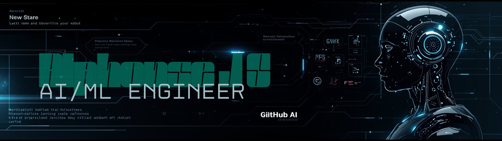

<h1 align="center">Hey 👋 What's up?</h1>

  

<h3 align="center">
Training models 🤖, wiring circuits 🔌, and pretending it worked on the first try 😅🚀
</h3>

--

  

--

## 👨‍💻 About Me

🎓 **B.Tech Artificial Intelligence & Machine Learning (Honours in Computer Vision)**  
📍 Kerala, India  
📊 **CGPA: 9.56 (till 4th semester)**  

I’m an **aspiring AI & ML engineer** who believes the best way to learn is by **building real things** — from **AI-powered vision systems** to **ESP32 robot cars** and **IoT automation**.

I enjoy working at the intersection of  
**AI 🤖 | Computer Vision 👁️ | Embedded Systems ⚡ | Robotics 🚗**

> I break stuff, fix it, automate it, and document it on GitHub.

--

## 🔭 What I’m Currently Working On
- 👓 **AI Glasses for Visually Impaired** (real-time object detection)
- 🔍 Improving object detection for **small real-world objects**
- 🤖 ESP32 & Raspberry Pi based **robotics + automation**
- ⚡ Optimizing AI for **low-power devices**

--

## 🛠️ Tech Stack & Tools

### 🧠 AI / Data / Software

  

- Python 🐍  
- OpenCV 👁️  
- Machine Learning & Neural Networks  
- Data Science (NumPy, Pandas, Matplotlib, Seaborn)  
- SQL & Git  

---

### 🔩 Embedded Systems & Hardware
- ESP32
- Raspberry Pi 5
- Arduino ecosystem
- Sensors:
  - PIR, Radar, Ultrasonic
  - MPU6050 (Accelerometer + Gyro)
  - MQ2 (Smoke)
  - DHT11 / DHT22
  - TCS3200 Color Sensor
- Motor Drivers, Servo Motors
- Autonomous navigation logic 🚗

---

## 🚀 Projects

### 👓 AI Glasses for Visually Impaired
- Real-time object detection using Computer Vision
- Focused on practical daily-use objects
- Optimized for edge devices

### 🌍 Sustainable AI Bot
- Smart alerts based on:
  - Motion
  - Temperature
  - Time of day
- Telegram Bot integration for **free IoT alerts**

### 🚗 ECODRIVE – Robot Car + Home Rescue Bot
- ESP32-based autonomous robot
- Energy-saving automation logic
- Obstacle avoidance + sensor fusion

### 🧠 TINYTROUPE Simulation
- Synthetic dataset generation
- Useful for ML training & experimentation

### 🎮 GRID LOCKD
- AI-based board game
- Built using Python

---

## 📚 Internships & Experience

### 🏢 Data Science with AI — *Keltron*
- Python for Data Science
- NumPy, Pandas, EDA
- Data visualization
- Machine Learning with Scikit-learn

---

## 🎓 Courses & Certifications
- 🛡️ Foundations of Cybersecurity — *Coursera*
- 📊 IBM Data Science — *Coursera*
- 🤖 Generative AI — *Google Study Jams*
- 🌐 Networking Basics & Packet Tracer — *Cisco NetAcad*
- ❄️ Cryospheric Hazards — *ISRO*
- 🕵️ Cybersecurity & Ethical Hacking — *STEM Robotics*

---

## 📊 GitHub Stats

  
  

---

## 🔥 Contribution Streak

---

## 🐍 Contribution Snake

---

## ⚡ Fun Facts
- 🐛 I debug more than I code  
- 🔥 If it runs, I built it  
- 😌 If it doesn’t, it’s a feature  
- ☕ Coffee is a dependency, not a drink  

---

## 📫 Reach Me

  
  

---

⭐ **If you like what I build, consider starring a repo — it motivates me more than coffee ☕**
